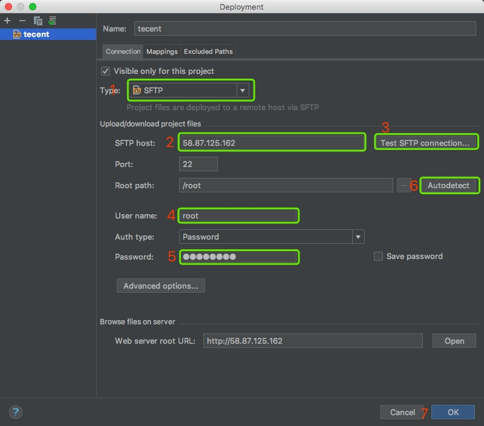
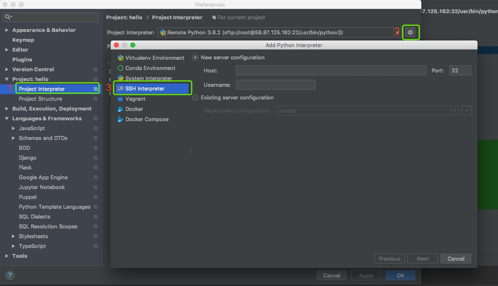
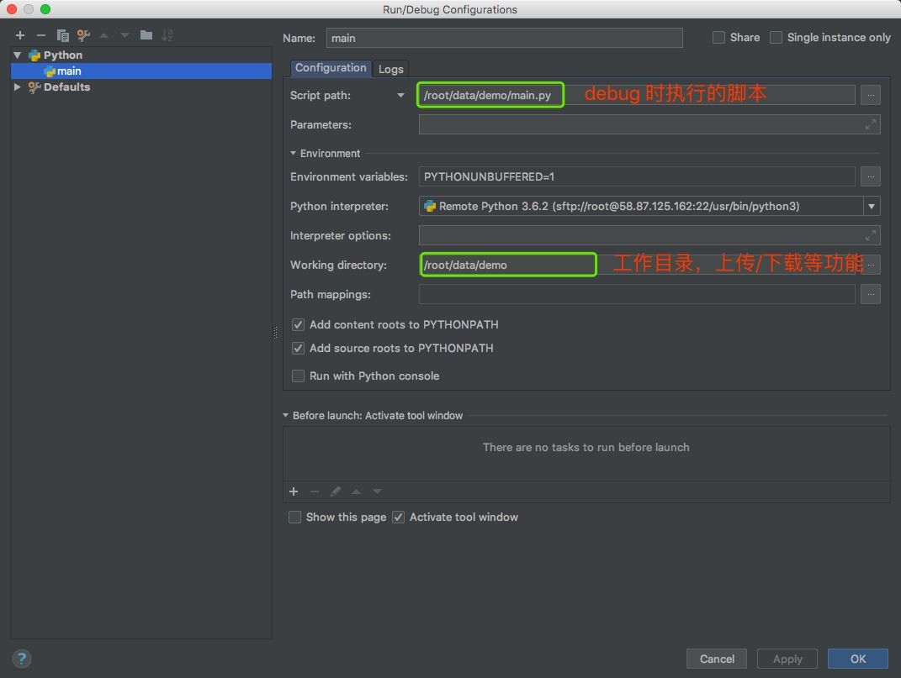
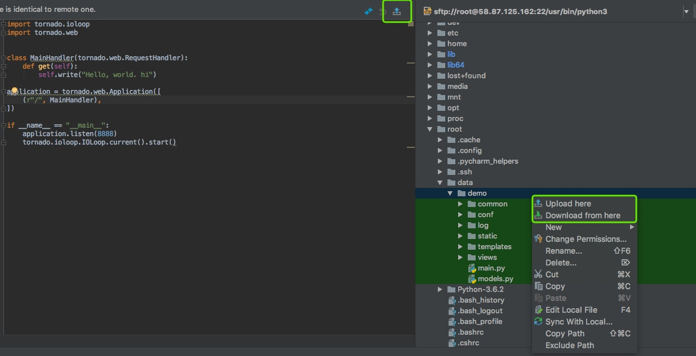

# app 服务端开发
----------------------------------

## Pycharm 远程调试


### 配置远程连接

```pytho
Tools -> Deployment -> Configuration -> new
```



### 添加 remote 解释器

```
Pycharm -> Preference -> Project:xxx -> Project Interpreter -> project Interpreter    setting -> SSH Interpreter
输入 host, Username, password
```



### 设置 'debug 配置'
```
Run -> Edit Configurations -> add -> Python
```



### 代码更新



## 服务器初始配置

### 安装python 3.6

```
yum -y groupinstall "Development tools"

yum -y install zlib-devel bzip2-devel openssl-devel ncurses-devel sqlite-devel readline-devel tk-devel gdbm-devel db4-devel libpcap-devel xz-devel

# 下载python
wget https://www.python.org/ftp/python/3.6.2/Python-3.6.2.tar.xz

# 创建安装目录
mkdir /usr/local/python3

#安装gcc
yum -y install gcc

# 安装python
tar -xvJf  Python-3.6.2.tar.xz
cd Python-3.6.2
./configure --prefix=/usr/local/python3
make && make install

# 创建软链
ln -s /usr/local/python3/bin/python3 /usr/bin/python3
ln -s /usr/local/python3/bin/pip3 /usr/bin/pip3

# 测试安装
python3
```

### 安装依赖库

```
# 升级pip
pip3 install --upgrade pip

# 安装依赖库
pip3 install flask
pip3 install pymysql
pip3 install flask-sqlalchemy
pip3 install uwsg
pip3 install flask-script
```

### 安装mysql

```
yum install mysql-devel
wget http://dev.mysql.com/get/mysql-community-release-el7-5.noarch.rpm
rpm -ivh mysql-community-release-el7-5.noarch.rpm
yum -y install mysql-community-server
pip3 install mysqlclient
service mysqld restart

# 测试安装状态
systemctl status mysqld.service
```

### 升级git

```
yum install curl-devel expat-devel gettext-devel openssl-devel zlib-devel asciidoc
yum install  gcc perl-ExtUtils-MakeMaker
yum remove git
cd /usr/local/src/
wget https://www.kernel.org/pub/software/scm/git/git-2.15.1.tar.xz
tar -vxf git-2.15.1.tar.xz
cd git-2.15.1
make prefix=/usr/local/git all
make prefix=/usr/local/git install
echo "export PATH=$PATH:/usr/local/git/bin" >> /etc/profile
source /etc/profile
git --version
```


## fix bugs

- Cannot assign requested address

```
# 这个host应该是内网ip
app.run(host='172.21.0.11', port='5000')
```

